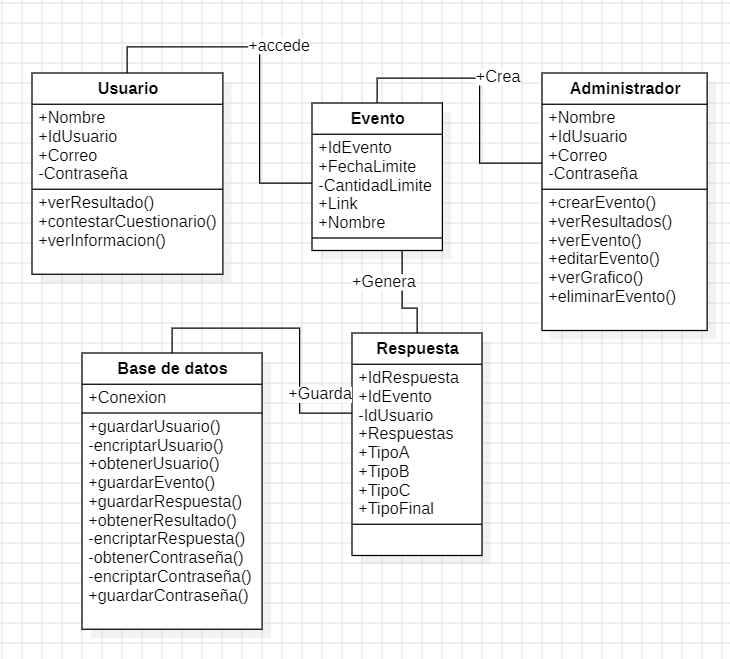
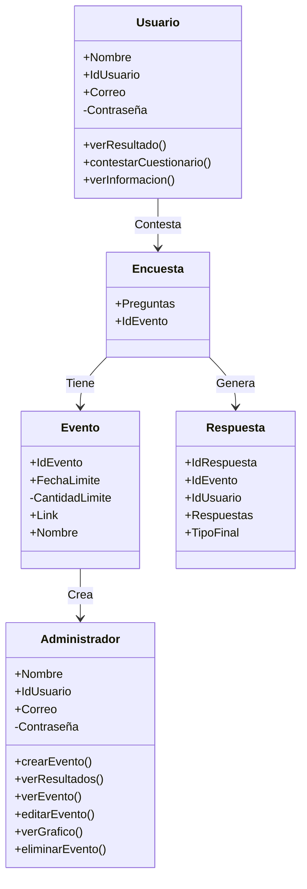
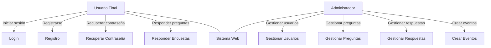
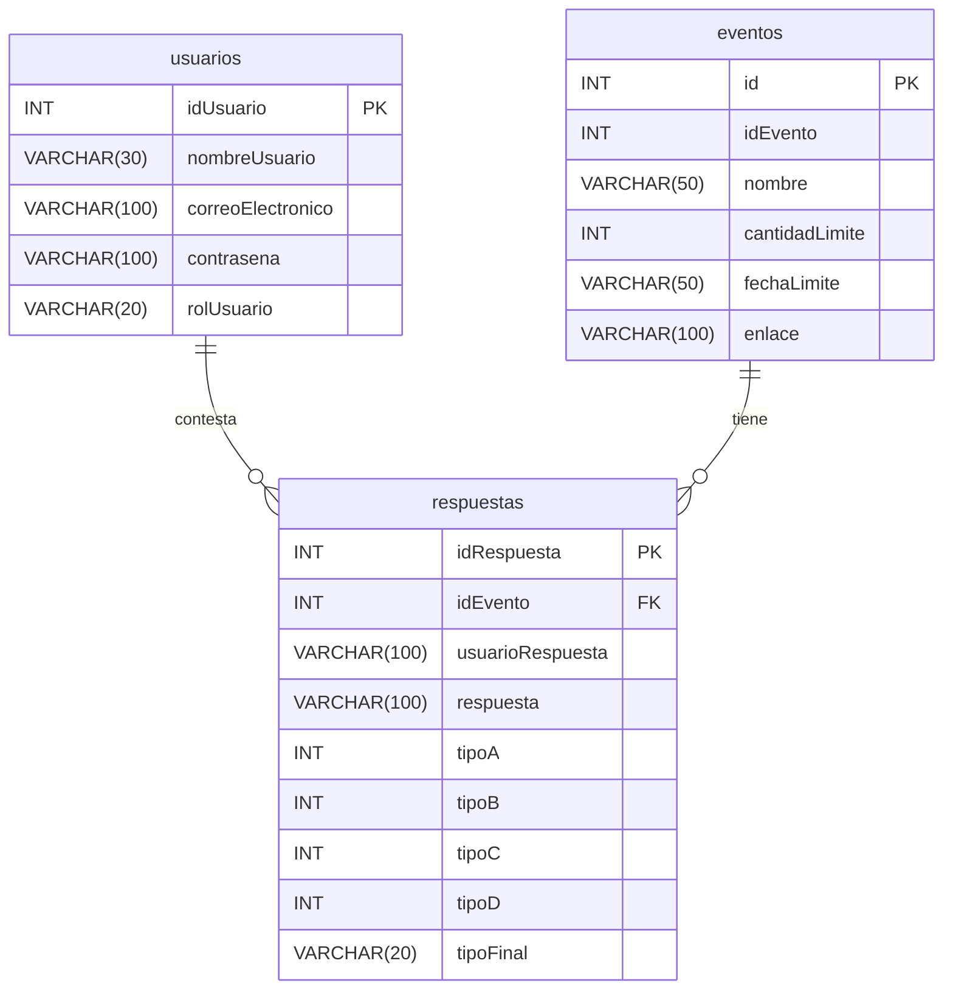
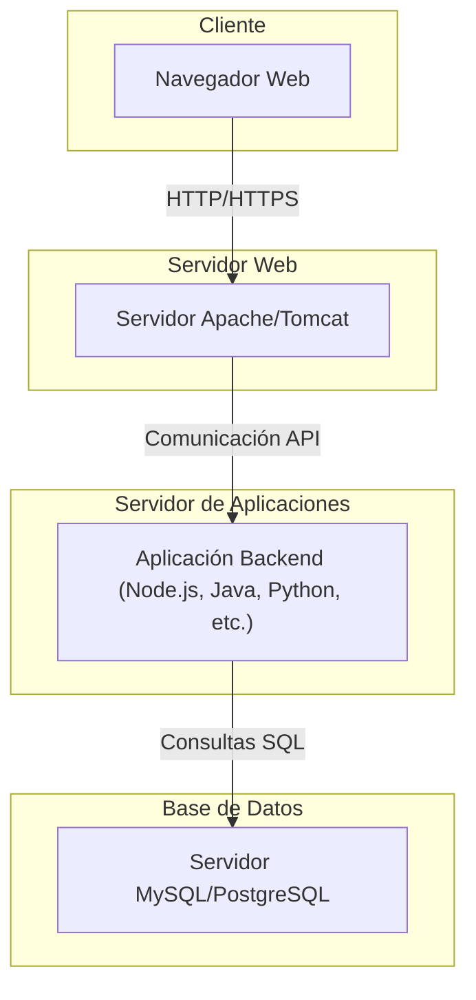
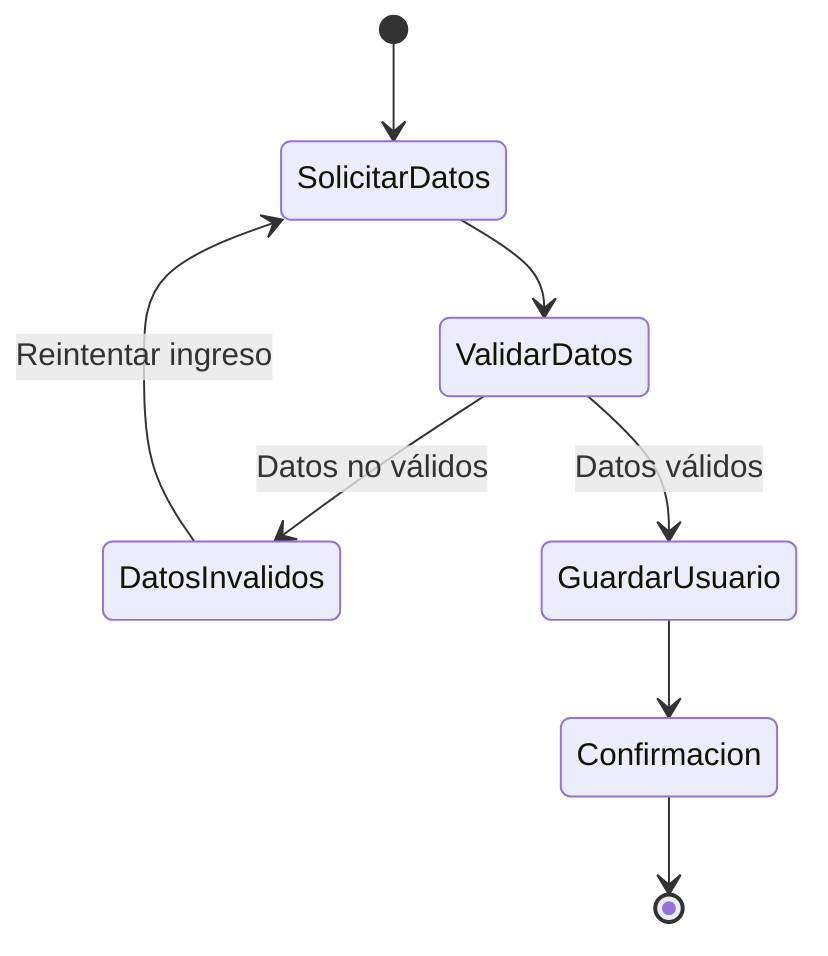
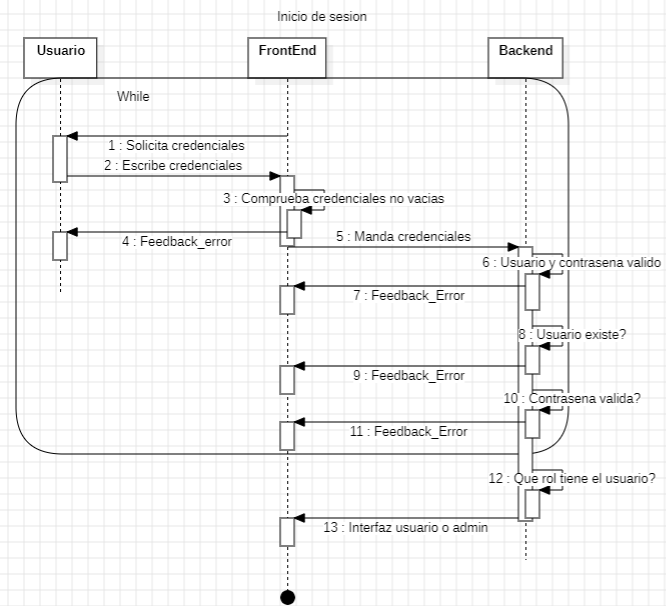
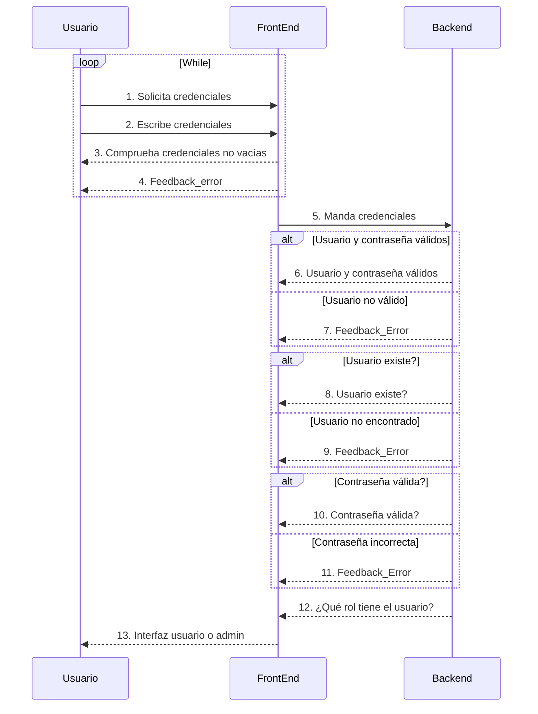
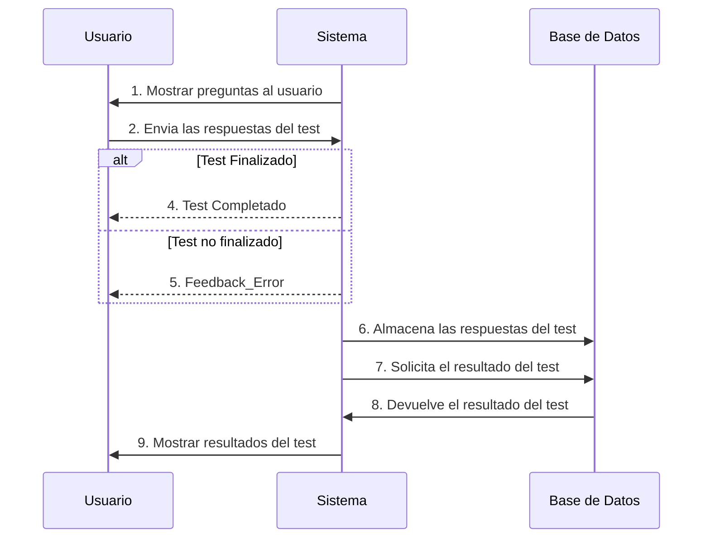

 

 <b>Practica 1</b> 

 <b>Escuela:</b>  Instituto Tecnológico Superior De Irapuato 

 <b>Carrera:</b> Ingeniería en Sistemas Computacionales 

 <b>Integrantes:</b> 

Arévalo Salinas Karina Janet IS21110440  
Diaz Zavala Daniel lS21111005  
Hernández Vázquez Karen Daniela IS21110660  
Ledesma Medina Jonathan IS21110030  
Montenegro Guerrero Óscar IS21110922  
Muños Olvera Francisco Gerardo IS21110228   
Natal Velazquez Kimberly Michelle IS21110668  
Villanueva Barbosa Jesús Ismael IS21110829  
Vazquez Garcia Nahum Josue IS21111282

 <b>Materia:</b> Arquitectura y Diseño de Software 

 <b>Grupo:</b> ISCC70C 

 <b>Profesor: </b> Manuel Alejandro Guzmán hernández 

 <b>Semestre: </b> Enero-mayo 2025 

 <b>Tema: </b> Dominancia Cerebral

# Entendimiento y descripción del Problema
La dominancia cerebral es muy util en diversas evaluaciones en las que se necesita identificar la forma de trabajar y el desempeño en distintas habilidades, esto dependiendo de que tipo de dominancia llegue a tener cada persona, por lo que para considerar a alguien para un puesto en específico, conocer este dato de la persona seria de utilidad para considerarlo o no, al igual que se puede hacer en alumnos para conocer las necesidades y poder tener un mejor desempeño Profesor-Alumno.
Sin embargo tener acceso a esta información de forma clara precisa y sin ser invasiva con el usuario, es decir no exponerlo a estimulos como una entrevista cara a cara en la que su comportamiento y respuestas puedan ser poco naturales, es poco comun, por lo que una pagina donde tu puedas crear un evento unico para hacer una encuesta a un grupo de personas determinadas en la que solo tu tengas los resultados sin la capacidad de ser alterados, seria muy util para los casos antes mecionados.
# Descomposición de los elementos del problema
#### 1. **Interfaces** 🫡
- Diseño intuitivo para el facil manejo del sistema.

#### 2. **Validación y Autenticación**🔒
- Autorización al sistema mediante un modulo para registro de usuarios.
- Gestión de roles y permisos.
- Alertas por correos no validos,no existentes o por credenciales vacias.
-  Protección contra SQL injection.

#### 3. **Gestión de los datos**⚙️
- Base de datos segura para el almacenamiento de información.

#### 4. **Cumplimiento de ISO 27001**👩‍🔧
- Documentación de políticas de seguridad.
- Identificación y prevención de riesgos.
- Implementación de controles de seguridad adecuados.

#### 5. **Feedback**🚨
- Envio de alertas o notificaciones segun una accion del usuario o sistema.

#### 6. **Interfaz de usuario** 💻
- Función para contestar un formulario
- Función para ver resultados.
- Función para ver informacion acerca de los tipos de dominancia.
- Función para cerrar sesión

#### 7. **Interfaz para respuesta de cuestionario**📃
- Conectada a la base de datos
- Función enviar un formulario
- Validación de respuestas

### 8. **Interfaz de administrador**📈
- Función para crear un evento
- Función para ver los resultados de un evento
- Funcion para editar un evento
### 9. **Interfaces de respuesta de dominio cerebral**🧠
- Evaluación de las respuestas y en base de ellas arrojar un resultado
- Tablas o graficos para visualizar los datos relevantes.

# Diagrama de clases de la integración

# Diagramas UML
#### **1. Diagrama de Casos de Uso**

#### **2. Diagrama de Base de Datos**

#### **3. Diagrama de Despliegue**

#### 4. Diagrama de Actividad

#### 5. Diagrama de secuencia

### Diagrama de Mostrar resultados
 

# Investigar la implementación de ISO 27001 en su Proyecto

#### Que es la norma ISO 27001
La norma ISO 27001 es contar con un sistema de gestión de seguridad de la información basado en la norma ISO 27001 para proteger los datos 

#### Que permite la ISO 27001
La norma ISO 27001 permite que los datos suministrados sean confidenciales, íntegros, disponibles y legales para protegerlos de los riesgos que se puedan presentar. Contar con este sistema dentro de la organización genera confianza entre los clientes, proveedores y empleados, además, es un referente mundial. 

Ofrece herramientas que permiten asegurar, integrar y tener de manera confidencial toda la información de la compañía y los sistemas que la almacenan, evitando así que un ciberataque se materialce y así mismo, hacer más competitiva a la empresa y cuidar su reputación.

#### Proceso de implementación de la ISO 27001
1.	#### Análisis inicial
* Definicion del alcance del SGSI del proyecto: ¿Qué partes de la prueba estarán protegidas bajo ISO 27001? las bases de datos de resultados, datos personales de los usuarios y sistema backend.
* Partes interesadas del sistema: usuarios y administradores del sistema.
* Los objetivos de seguridad de la información son garantizar la privacidad de los usuarios y la protección de datos sensibles.

2.	#### Identificación de riesgos
* **Activos**: Datos personales de los usuarios y resultados de las encuestas.
* **Riesgos posibles:** ¿Qué amenazas podrían comprometer estos activos? Accesos no autorizados, o pérdida de datos.
* **Evaluar el impacto:** Determina el daño que causaría cada riesgo.
* **Planificar el tratamiento de riesgos:** En caso de una perdidad de informacion, los datos seran evaluados para determinar si se debe mitigar o mejora.

3.	#### Definición de alcance
* **Política de privacidad de datos:** Los datos de los usuarios son almacenados en una base de datos, y se definen cómo se recopilan, almacenan y utilizan los datos del usuario.
* **Gestión de acceso:** Se definen roles y permisos para acceder al sistema (administradores y usuarios).
los **administradores** tienen acceso a todas las funciones del sistema como por ejmplo.

* **Gestión del Sistema:** Configurar, supervisar y mantener el sistema.
* **Control de Accesos:** Crear y gestionar las cuentas de usuarios, estableciendo los permisos necesarios.
* **Monitoreo de Datos:** Revisar y analizar el rendimiento del sistema para garantizar que funcione sin interrupciones.
* **Resolución de Problemas:** Solucionar errores técnicos que puedan surgir en la plataforma.
* **Actualización y Seguridad:** Implementar actualizaciones y medidas de seguridad para proteger los datos de los usuarios y los resultados del test.

Mientras que los **usuarios** solo tienen acceso a las funciones que les permiten realizar su trabajo por ejmplo.

* **Realización del Test:** Completar el test de dominancia cerebral respondiendo las preguntas de acuerdo con las instrucciones.
* **Consulta de Resultados:** Visualizar e interpretar los resultados obtenidos.
* **Registro y Acceso:** Crear una cuenta o iniciar sesión en la plataforma para acceder al test.
* **Descarga de Información:** Descargar reportes o análisis del test.
* **Control de incidentes:** En caso de que ocurra un incidente, se definen los procedimientos para identificar, responder y resolver incidentes de seguridad como por ejemplo backups de la base de datos, monitoreo de los logs, etc.

4.	#### Desarrollo de controles y políticas**

**Controles técnicos:**

* Encriptación de datos sensibles.
* utenticación y autorización de usuarios.
* Auditorías de acceso y monitoreo del sistema y sera creando una tabla en la base de datos que registre cada accion de cada persona.

**Controles organizativos:**

* Capacita a los colaboradores en seguridad de la información.

5.	#### Capacitación
* Integrar herramientas tecnológicas para monitorear y proteger los datos, como firewalls, software de análisis de vulnerabilidades.
6.	#### Auditorias internas**
Realizacion de  auditorías internas para asegurarte de que los controles funcionan como se espera.
Realizacion de pruebas para identificar incidentes y realizar mejoras continuas en el SGSI.

 