 

 <b>Práctica 1</b>

 <b>Escuela:</b>
Instituto Tecnológico Superior de Irapuato 

 <b>Carrera:</b> Ingeniería en Sistemas Computacionales 

 <b>Integrantes:</b>

 
 Arévalo Salinas Karina Janet IS21110440  
 Díaz Zavala Daniel IS21111005  
Hernández Vázquez Karen Daniela IS21110660  
Campos Guevara Fabiola Margarita IS21110197  
Ledesma Medina Jonathan IS21110030  
Montenegro Guerrero Óscar IS21110922  
Muñoz Olvera Francisco Gerardo IS21110228  
Natal Velázquez Kimberly Michelle IS21110668  
Villanueva Barbosa Jesús Ismael IS21110829  
Vazquez García Nahum Josué IS21111282 

<b>Materia:</b>
Arquitectura y Diseño de Software 

 <b>Grupo:</b> ISCC70C 

 
<b>SR DOCTOR MAESTRO PROFESOR INGENIERO:</b> Manuel Alejandro Guzmán Hernández 

 <b>Semestre:</b> Enero-Mayo 2025 

 <b>Tema:</b> Dominancia Cerebral

# Entendimiento del problema
La dominancia cerebral es muy útil en diversas evaluaciones en las que se necesita identificar la forma de trabajar y el desempeño en distintas habilidades, dependiendo del tipo de dominancia de cada persona. Por ello, conocer esta
información es valioso para considerar a alguien para un puesto específico o para entender las necesidades de los
alumnos y mejorar el desempeño en la relación profesor-alumno.

Sin embargo, obtener esta información de manera clara, precisa y no invasiva es poco común. Una página web que permita
crear un evento único para realizar encuestas a un grupo de personas determinadas, donde solo el creador tenga acceso
a los resultados y estos no puedan ser alterados, sería muy útil para los casos mencionados.

# Descomposición de los elementos del problema
- Interfaces 🫡
- Validación y Autenticación🔒
- Gestión de los datos ⚙️
- Cumplimiento de ISO 27001👩‍🔧
- Feedback🚨
- Interfaz de usuario 💻
- Interfaz para respuesta de cuestionario📃
- Interfaz de administrador📈
- Interfaces de respuesta de dominio cerebral🧠

# Diagrama de clases de la integración

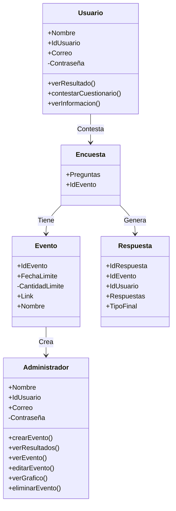

# Diagramas UML
#### **1. Diagrama de Casos de Uso**
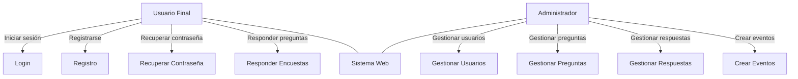
#### **2. Diagrama de Base de Datos**

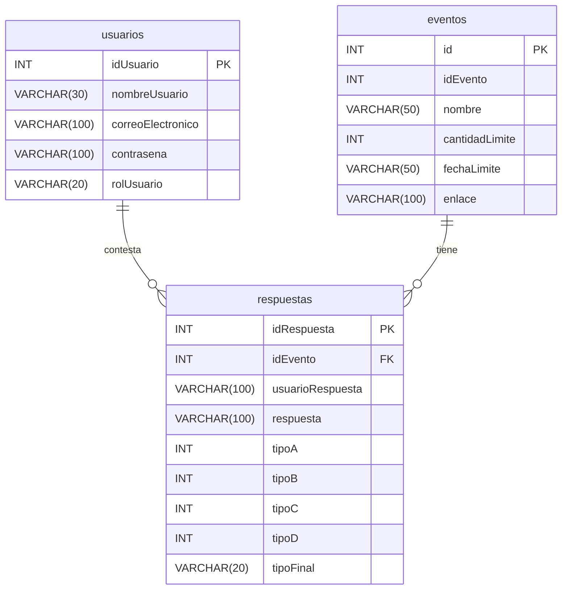
#### **3. Diagrama de Despliegue**
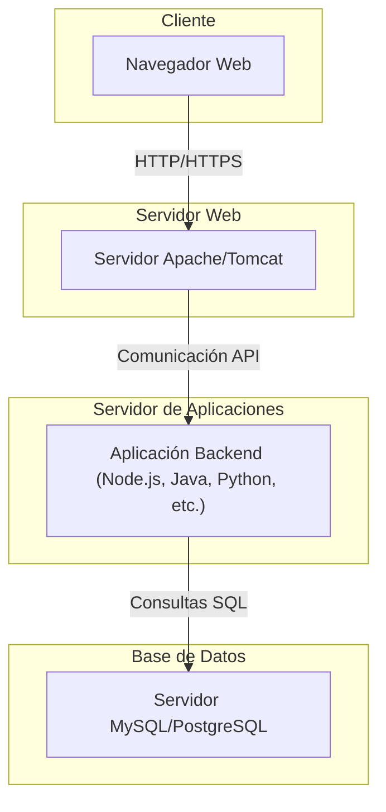

#### 4. Diagrama de Actividad

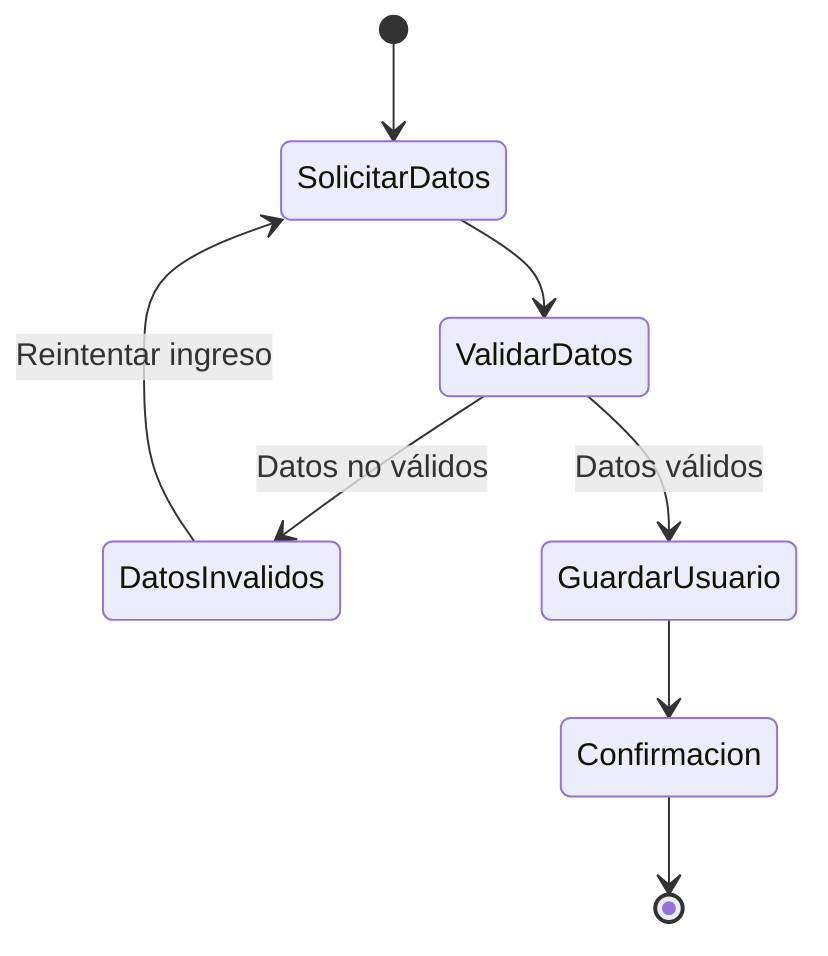
## 5. Diagrama de secuencia
### 1. login

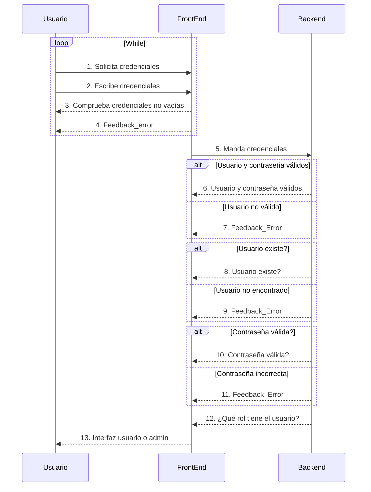

### 2. Diagrama de Registro
### 3. Diagrama de Contestar cuestionario

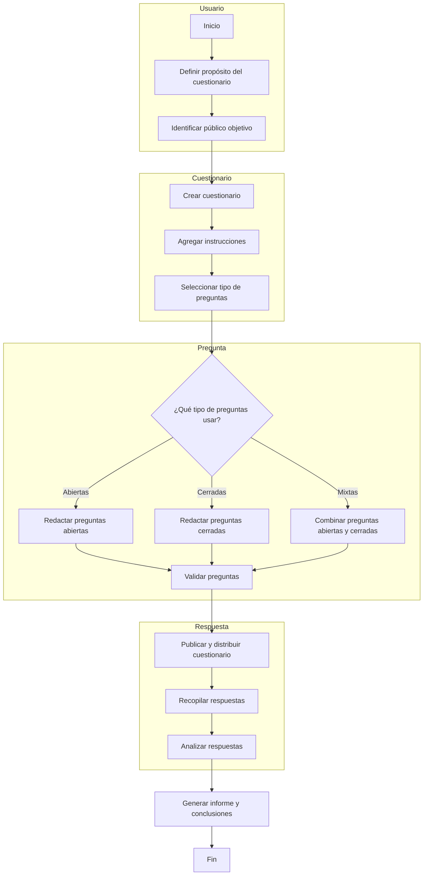

### 4. Diagrama de Mostrar resultados

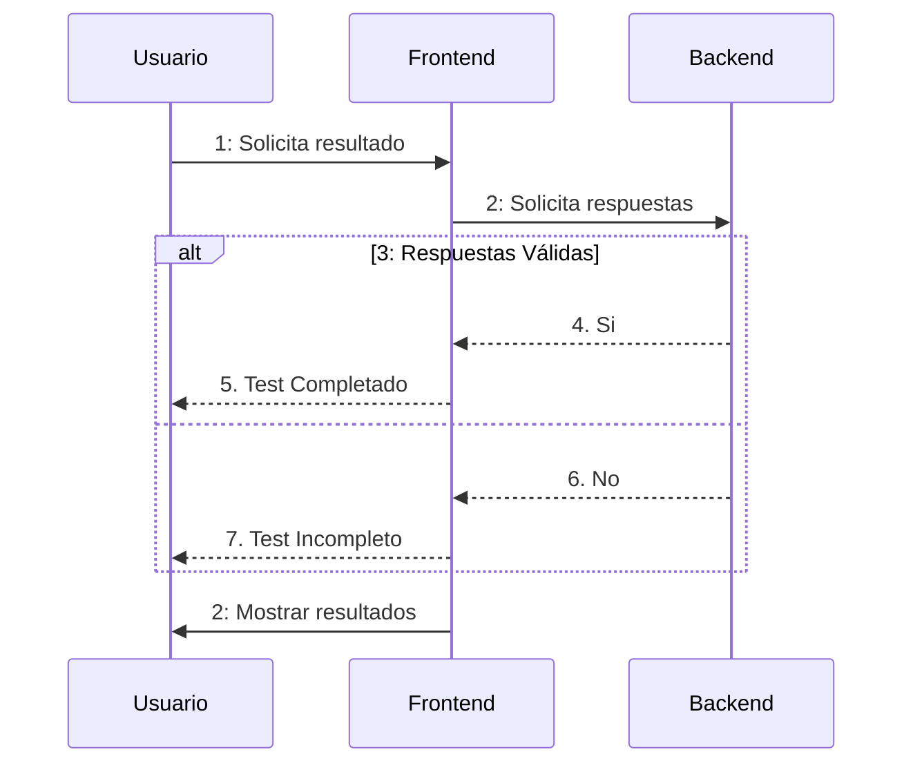

### 5. Diagrama de cerrar sesión

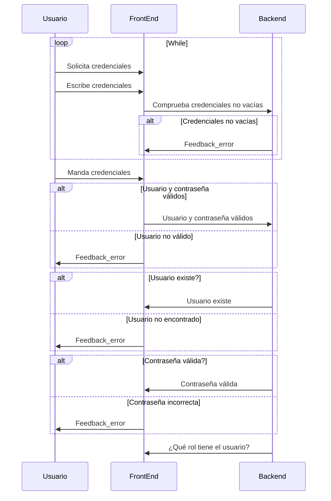

### 6. Diagrama de Modo Nocturno

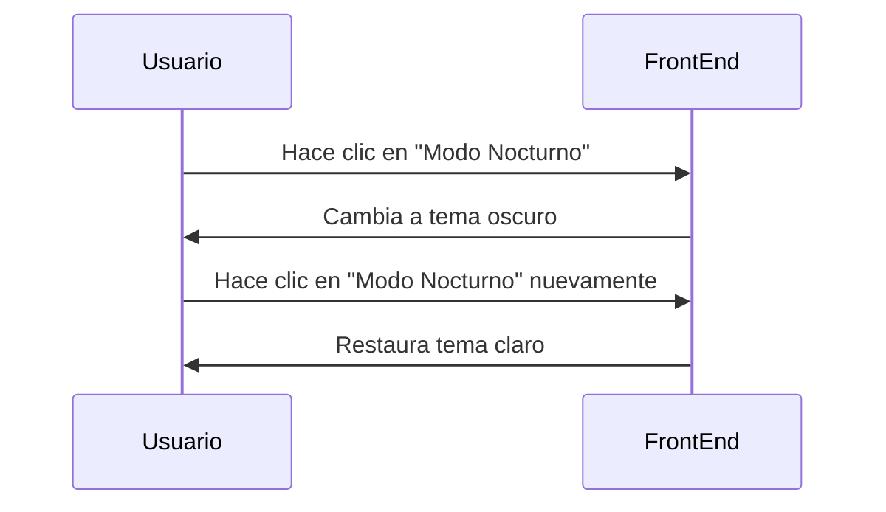

### 7. Diagrama de Crear evento
### 8. Diagrama de Ver gráfica

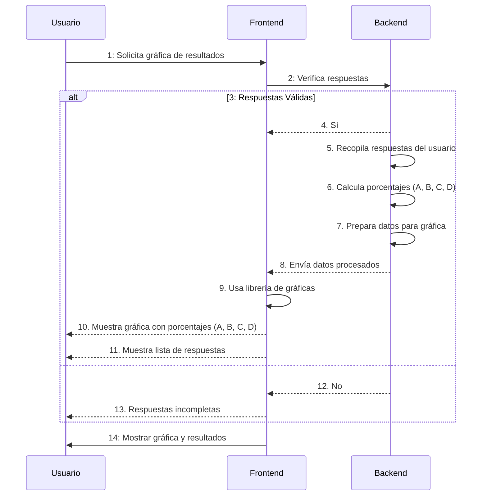

### 9. Diagrama de Ver resultados

# Implementación de ISO 27001 en el proyecto

#### ¿Qué es la norma ISO 27001?
La norma ISO 27001 establece un sistema de gestión de seguridad de la información para proteger los datos.

#### Beneficios de la ISO 27001
- Garantiza la confidencialidad, integridad, disponibilidada y legalidad de los datos.
- Genera confianza entre clientes, proveedores y empleados.
- Ofrece herramientas para proteger la información contra ciberataques.

#### Proceso de implementación
1.	#### Análisis inicial
- Definición del alcance del SGSI de los resultados, datos personales de los usuarios y sistema backend.
- Identificación de partes interesadas (usuarios y administradores).
- Establecimiento de objetivos de seguridad para garantizar la privacidad de los usuarios y la protección de datos sensibles.

2.	#### Identificación de riesgos
- **Activos**: Datos personales de los usuarios y resultados de las encuestas.
- **Riesgos posibles:** Accesos no autorizados o pérdida de datos.
- **Evaluar el impacto:** Determina el daño que causaría cada riesgo.
- **Planificar el tratamiento de riesgos:** En caso de una perdidad de informacion, los datos seran evaluados para determinar si se debe mitigar o mejora.

3.	#### Definición de alcance
- **Política de privacidad de datos:** Los datos de los usuarios son almacenados en una base de datos, y se definen cómo se recopilan, almacenan y utilizan los datos del usuario.
- **Gestión de acceso:** Se definen roles y permisos para acceder al sistema (administradores y usuarios).
los **administradores** tienen acceso a todas las funciones del sistema como por ejmplo.

- **Gestión del Sistema:** Configurar, supervisar y mantener el sistema.
- **Control de Accesos:** Crear y gestionar las cuentas de usuarios, estableciendo los permisos necesarios.
- **Monitoreo de Datos:** Revisar y analizar el rendimiento del sistema para garantizar que funcione sin interrupciones.
- **Resolución de Problemas:** Solucionar errores técnicos que puedan surgir en la plataforma.
- **Actualización y Seguridad:** Implementar actualizaciones y medidas de seguridad para proteger los datos de los usuarios y los resultados del test.

Mientras que los **usuarios** solo tienen acceso a las funciones que les permiten realizar su trabajo por ejmplo.

- **Realización del Test:** Completar el test de dominancia cerebral respondiendo las preguntas de acuerdo con las instrucciones.
- **Consulta de Resultados:** Visualizar e interpretar los resultados obtenidos.
- **Registro y Acceso:** Crear una cuenta o iniciar sesión en la plataforma para acceder al test.
- **Descarga de Información:** Descargar reportes o análisis del test.
- **Control de incidentes:** En caso de que ocurra un incidente, se definen los procedimientos para identificar, responder y resolver incidentes de seguridad como por ejemplo backups de la base de datos, monitoreo de los logs, etc.

4.	#### Desarrollo de controles y políticas

**Controles técnicos:**

- Encriptación de datos, autenticación y autorización.
- Autenticación y autorización de usuarios.
- Capacitación en seguridad de la información.

**Controles organizativos:**

- Capacita a los colaboradores en seguridad de la información.

5.	#### Capacitación
- Integrar herramientas tecnológicas para monitorear y proteger los datos, como firewalls, software de análisis de vulnerabilidades.
6.	#### Auditorias internas
Realizacion de  auditorías internas para asegurarte de que los controles funcionan como se espera.
Realizacion de pruebas para identificar incidentes y realizar mejoras continuas en el SGSI.

# AOO

## Analisis de requerimientos:
### Definición del sistema en general

Sistema web que permite la administración de encuestas y los 4 tipos de dominancia cerebral de una persona mostrando sus resultados de manera grafíca y escrita, limitando el numero de personas con acceso a la encuesta a través de fecha de cierre y limite de respuestas, para esto el sistema generara de manera automatica un link unico el cual dara acceso a la encuesta correspondiente.

En relación al usuario, al momento del inicio de sesión este podra visualizar información correspondiente a cada tipo de dominancia cerebral y al finalizar la encuesta el sistema arrojara los resultados de su dominancia de manera grafíca y escrita. Cada usuario tendrá solo una oportunidad de responder la encuesta y que esta se registre en la base de datos de nuestro sistema web.

### Requisitos y partes del sistema

  
#### 1. **Interfaces** 🫡

- Inicio de sesión
- Registrar
- Recuperación de credenciales
- Administrador: 
    - Ventana Principal
    - Visualización de eventos
    - Creación de eventos
    - Sección de respuestas
    - Visualización de Grafícos
- Usuario: 
    - Ventana de bienvenida
    - Sección de resultados
    - Cuestionario
    - Descripción de loss tipos de dominancia

#### 2. **Validación y Autenticación**🔒
- Autorización al sistema mediante un modulo para registro de usuarios.
- Alertas por correos no validos,no existentes o por credenciales vacias.
-  Protección contra SQL injection.
-  Limite de una respuesta por usuario a un evento.
-  Solo debe haber una opción seleccionada por respuesta
-  La encuesta solo puede ser contestada mientras este disponible
-  Creación de eventos en una fecha valida.
-  Se debe iniciar sesión para acceder al sistema.

#### 3. **Gestión de los datos**⚙️
- Base de datos segura para el almacenamiento de información mediante encriptación de datos.

#### 4. **Retroalimentación al usuario**🚨
- Envio de alertas o notificaciones cada vez que sea necesario.

#### 6. **Funciones de la seccion de usuario** 💻
- Función para contestar un formulario
- Función para cerrar sesión
- Seccion de informacion de los 4 tipos de dominancia cerebral
- Funcion para conocer sus resultados

#### 8. **Funciones de la seccion administrador**📈
- Función para crear,editar,desactivar un evento
- Función para ver las respuestas de un evento
- Funcion para ver las respuestas globales

## Diseño: 
**Arquitectura**
Al aplicar la arquitectura cliente-servidor a nuestro proyecto, podemos estructurarlo de la siguiente manera:

**Cliente (Navegador Web):**
El usuario interactúa con la aplicación a través de una interfaz desarrollada con tecnologías como HTML, CSS
y JavaScript. Las principales funciones que realiza el cliente incluyen:

- Registro de usuario.
- Envío de solicitud de inicio de sesión.
- Respuesta al cuestionario.
- Visualización de resultados en formato gráfico.
- (Para administradores) Creación de eventos.
- (Para administradores) Consulta de resultados generales.

Además, el cliente recibe datos del servidor en formato JSON y los muestra al usuario de manera dinámica.

**Servidor (Backend):**
El servidor maneja la lógica principal de la aplicación utilizando PHP e incluye las siguientes responsabilidades:
- Gestión de usuarios (registro y autenticación).
- Almacenamiento y procesamiento de respuestas del cuestionario.
- Generación y visualización de resultados.
- Creación de gráficos con la librería Chart.js.
- Gestión integral de eventos (creación, edición y acceso).
- Validación y control de datos.

**Base de Datos:** 
El servidor interactúa con una base de datos MySQL para almacenar y gestionar la siguiente información:
- Datos de los usuarios.
- Preguntas del cuestionario.
- Opciones de respuesta.
- Resultados de los tests.
- Información sobre los eventos creados.

 